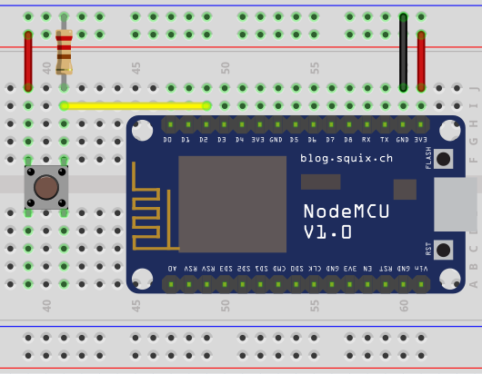
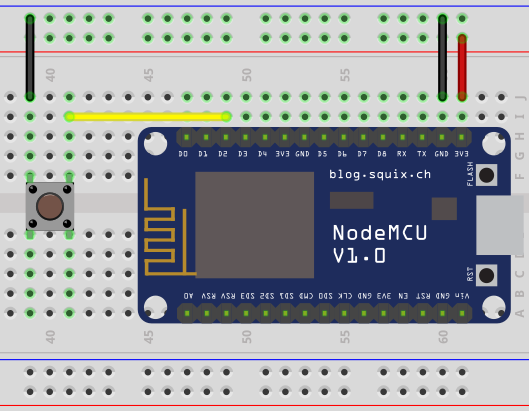

esp-button
==========
Library for [ESP-OPEN-RTOS](https://github.com/SuperHouse/esp-open-rtos) to handle
button and toggle input.

Before you start using library, you need to figure out how button is/will be wired.
There are two ways to wire button:
* active high - signal goes from low to high when button is pressed

  
* active low - signal connects to ground when button is pressed

  

```c
#include <button.h>

#define BUTTON_PIN 5

void button_callback(button_event_t event, void* context) {
    printf("button press\n");
}

button_config_t config = BUTTON_CONFIG(button_active_high);

int r = button_create(BUTTON_PIN, config, button_callback, NULL);
if (r) {
    printf("Failed to initialize a button\n");
}
```

Button config settings:
* **active_level** - `button_active_high` or `button_active_low` - which signal level corresponds to button press. In case of `button_active_low`, it automatically enables pullup resistor on button pin. In case of `button_active_high`, you need to have an additional pulldown (pin-to-ground) resistor on button pin.
* **long\_press_time** - if set, defines time in milliseconds, after which button press is considered a long press. If set to 0, long press tracking is disabled.
* **max\_repeat_presses** - maximum number of repeated presses. Valid values are 1, 2 or 3 (single, double or tripple presses).
* **repeat\_press_time** - defines maximum time in milliseconds to wait for subsequent press to consider it a double/tripple press (defaults to 300ms).

Implementation effectively handles debounce, no additional configuration is required.

Example of using button with support of single, double and tripple presses:

```c
#include <button.h>

#define BUTTON_PIN 5

void button_callback(button_event_t event, void* context) {
    switch (event) {
        case button_event_single_press:
            printf("single press\n");
            break;
        case button_event_double_press:
            printf("double press\n");
            break;
        case button_event_tripple_press:
            printf("tripple press\n");
            break;
        case button_event_long_press:
            printf("long press\n");
            break;
    }
}

button_config_t config = BUTTON_CONFIG(
    button_active_high,
    .long_press_time = 1000,
    .max_repeat_presses = 3,
);

int r = button_create(BUTTON_PIN, config, button_callback, NULL);
if (r) {
    printf("Failed to initialize a button\n");
}
```

Example of using a toggle:

```c
#include <toggle.h>

#define TOGGLE_PIN 4

void toggle_callback(bool high, void *context) {
    printf("toggle is %s\n", high ? "high" : "low");
}

int r = toggle_create(TOGGLE_PIN, toggle_callback, NULL);
if (r) {
    printf("Failed to initialize a toggle\n");
}
```

Note: when using toggle, you need to make sure that signal is propperly pulled
up/down (either add resistor in case of pull up or enable builtin pullup resistor on
corresponding pin).

License
=======
MIT licensed. See the bundled [LICENSE](https://github.com/maximkulkin/esp-button/blob/master/LICENSE) file for more details.
