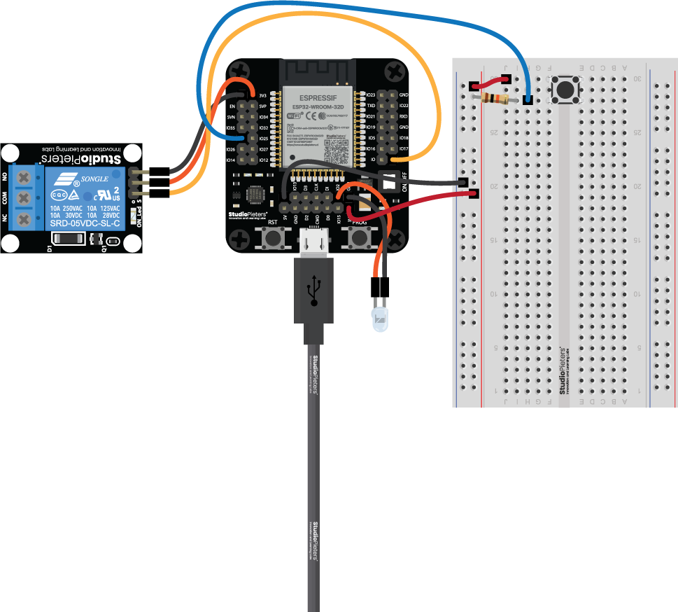

# WORK IN PROGRESS

# Example for `Aubess Power Monitor Switch`

## What it does

It's a example for the Aubess Power Monitor Switch module. It is a code to turn ON and OFF Power through HomeKit and a wall switch, Its also capable of monitoring its power consumption.

## Wiring

Connect `Aubess Power Monitor Switch` pin to the following pin:

| Name | Description | Defaults |
|------|-------------|----------|
| `CONFIG_ESP_LED_GPIO` | GPIO number for `LED` pin | "7" Default |
| `CONFIG_ESP_Button_GPIO` | GPIO number for `BUTTON` pin | "10" Default |
| `CONFIG_ESP_942RX_GPIO` | GPIO number for `942RX` pin | "RXD" Default |
| `CONFIG_ESP_942TX_GPIO` | GPIO number for `942TX` pin | "TXD" Default |
| `CONFIG_ESP_Wall_switch_GPIO` | GPIO number for `Wall switch` pin | "5" Default |
| `CONFIG_ESP_Relay_GPIO` | GPIO number for `Relay` pin | "4" Default |

## Scheme



## Requirements

Currently, a preview release is available, and can be installed like this:

```
idf.py add-dependency "wolfssl/wolfssl^5.7.1-preview2e"
```

To enable support for Apple HomeKit, be sure to check the respective box in `idf.py menuconfig`.

The local `sdkconfig.defaults` has been edited to enable the wolfSSL support for Apple HomeKit by default.

## Notes

- Choose your GPIO number under `StudioPieters` in `menuconfig`. The default is `2` (On an ESP32 WROOM 32D).
- Set your `WiFi SSID` and `WiFi Password` under `StudioPieters` in `menuconfig`.
- Optional: You can change `HomeKit Setup Code` and `HomeKit Setup ID` under `StudioPieters` in `menuconfig`. (Note:  you need to make a new QR-CODE To make it work)
