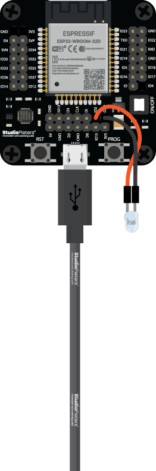

# Example for `LED`

## What it does

It's a "Hello World" example for the HomeKit Demo. It is a code to turn ON and OFF an LED connected to an ESP Module.

## Wiring

Connect `LED` pin to the following pin:

| Name | Description | Defaults |
|------|-------------|----------|
| `CONFIG_ESP_LED_GPIO` | GPIO number for `LED` pin | "2" Default |

## Scheme

## Notes

- Choose your GPIO number under `StudioPieters` in `menuconfig`. The default is `2` (On an ESP32 WROOM 32D).
- Set your `WiFi SSID` and `WiFi Password` under `StudioPieters` in `menuconfig`.
- Optional: You can change `HomeKit Setup Code` and `HomeKit Setup ID` under `StudioPieters` in `menuconfig`. (Note:  you need to make a new QR-CODE To make it work)
