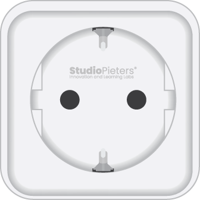

# Example for `LSC Smart Power Plug`

## What it does

It's a "Hello World" example for the HomeKit Demo. It is a code to turn ON and OFF an LED connected to an ESP Module.

Brand: LSC (Smart Connect)
Product: Smart Power Plug
VERSION: 970762 | 970764 | 970766
ART. No 2578685

## Wiring

Connect `LED` pin to the following pin:

| Name | Description | Defaults |
|------|-------------|----------|
| `CONFIG_ESP_RELAY_GPIO` | GPIO number for `RELAY` pin | "18" Default |
| `CONFIG_ESP_BUTTON_GPIO` | GPIO number for `BUTTON` pin | "10" Default |
| `CONFIG_ESP_RED_LED_GPIO` | GPIO number for `RED_LED` pin | "7" Default |
| `CONFIG_ESP_BLUE_LED_GPIO` | GPIO number for `BLUE_LED` pin | "4" Default |

## Scheme



## Requirements

Currently, a preview release is available, and can be installed like this:

```
idf.py add-dependency "wolfssl/wolfssl^5.7.1-preview2e"
```

To enable support for Apple HomeKit, be sure to check the respective box in `idf.py menuconfig`.

The local `sdkconfig.defaults` has been edited to enable the wolfSSL support for Apple HomeKit by default.

## Notes

- Choose your GPIO number under `StudioPieters` in `menuconfig`. The default is `2` (On an ESP32 WROOM 32D).
- Set your `WiFi SSID` and `WiFi Password` under `StudioPieters` in `menuconfig`.
- Optional: You can change `HomeKit Setup Code` and `HomeKit Setup ID` under `StudioPieters` in `menuconfig`. (Note:  you need to make a new QR-CODE To make it work)
