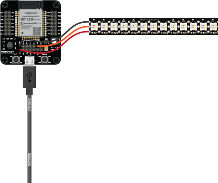

# Example for `RGB-IC + White LED STRIP`

## What it does

Based on a RGB-IC WS2812, RGBW LED strip. ON/OFF, Brightness, HUE and Saturation.

Brand: LSC (Smart Connect)
Product: Smart XXL LED STRIP
VERSION: -
ART. No 3202086

## Wiring

Connect `RGB-IC + White LED STRIP` pin to the following pin:

| Name | Description | Defaults |
|------|-------------|----------|
| `CONFIG_ESP_LED_GPIO` | GPIO number for `LED` pin | "5" Default |
| `CONFIG_ESP_STRIP_LENGTH` | Number of `LED'S` on strip | "3" Default |
| `CONFIG_ESP_COLD_WHITE_GPIO` | GPIO number for `COLD WHITE` pin | "18" Default |
| `CONFIG_ESP_WARM_WHITE_GPIO` | GPIO number for `WARM WHITE` pin | "19" Default |

## Scheme

## Notes

- Choose your GPIO number under `StudioPieters` in `menuconfig`. The default is `5` (On an ESP32 WROOM 32D).
- Choose your strip length under `StudioPieters` in `menuconfig`. The default is `3`.
- Choose your Cold White under `StudioPieters` in `menuconfig`. The default is `18`. (Note: Generally, GPIOs like GPIO18, GPIO19, GPIO21, GPIO22, GPIO23, and GPIO25-27 are commonly used with the ledc driver.)
- Choose your Warm White under `StudioPieters` in `menuconfig`. The default is `19`. (Note: Generally, GPIOs like GPIO18, GPIO19, GPIO21, GPIO22, GPIO23, and GPIO25-27 are commonly used with the ledc driver.)
- Set your `WiFi SSID` and `WiFi Password` under `StudioPieters` in `menuconfig`.
- Optional: You can change `HomeKit Setup Code` and `HomeKit Setup ID` under `StudioPieters` in `menuconfig`. (Note:  you need to make a new QR-CODE To make it work)
